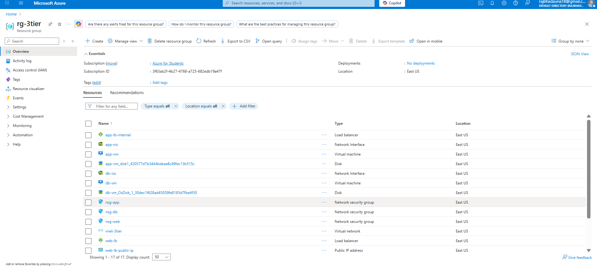

**Built by:** Raj Bhadauria  
**LinkedIn:** [linkedin.com/in/raj-bhadauria-58924219b](https://www.linkedin.com/in/raj-bhadauria-58924219b/)

# 3-Tier Web Application Infrastructure on Azure 

A secure, scalable 3-tier web application infrastructure deployed on Azure using Terraform. This project demonstrates proper network segmentation, security controls, and Infrastructure as Code best practices.

## Project Overview

I built this to move away from manual infrastructure provisioning and implement proper enterprise-level architecture patterns. The goal was to create a production-ready infrastructure that enforces security boundaries while maintaining scalability.

## Architecture & Security Design

### Network Segmentation
```
Internet
    ↓
[Public Load Balancer] (Static IP)
    ↓
[Web Tier - 10.0.1.0/24] ← SSH access via public IP
    ↓
[Internal Load Balancer] (Private IP)
    ↓  
[App Tier - 10.0.2.0/24] ← No direct internet access
    ↓
[DB Tier - 10.0.3.0/24] ← Completely isolated
```

### Security Controls

**Traffic Flow Enforcement:**
- Web tier can communicate with App tier only
- App tier can communicate with DB tier only  
- DB tier explicitly blocks any direct communication from Web tier
- Each tier isolated in separate subnets with dedicated NSGs

**Network Security Groups:**
```hcl
# Web NSG: Internet → Web (HTTP/HTTPS/SSH)
# Web NSG Outbound: Web → App tier only

# App NSG Inbound: Web tier → App only  
# App NSG Outbound: App → DB tier only

# DB NSG Inbound: App tier → DB only
# DB NSG: Explicit DENY rule for Web → DB traffic
```

**Load Balancer Strategy:**
- **Public LB**: Handles internet traffic distribution to web tier
- **Internal LB**: Routes web tier requests to app tier backend pool
- **No LB for DB**: Single database instance with direct connection from app tier

## Technical Implementation

### Infrastructure Components
- **3 VMs**: Ubuntu 20.04 LTS across different tiers
- **Load Balancers**: Public (Standard SKU) for web, Internal for app
- **Network**: VNet with 3 subnets, each with dedicated NSGs
- **Security**: SSH key authentication, no password access

### Terraform Structure
- **Variables**: 25+ configurable parameters with validation
- **Outputs**: Load balancer IPs, network details for integration
- **Environment Support**: Multi-environment deployment via .tfvars files

## Challenges & Solutions

### API Timeout Issues
Encountered "context deadline exceeded" errors during deployment:
```bash
# Solution: Increased provider timeout
provider "azurerm" {
  client_timeout_seconds = 1200  # Extended from default 300
}
```

### State Management Problems  
Hit resource creation conflicts and state inconsistencies:
```bash
# Used targeted applies to resolve dependencies
terraform apply -target=azurerm_resource_group.rg
terraform apply -target=azurerm_public_ip.web_lb_public_ip

# Imported existing resources when needed
terraform import azurerm_resource_group.rg /subscriptions/.../resourceGroups/rg-3tier
```

### Network Interface Associations
Backend pool associations failing due to timing:
```hcl
# Added explicit time delays and dependencies
resource "time_sleep" "wait_30_seconds" {
  create_duration = "30s"
  depends_on = [azurerm_subnet.web, azurerm_network_security_group.nsg_web]
}
```

### Authentication Refresh Issues
Random API failures requiring re-authentication:
```bash
az logout && az login
# Set explicit environment variables for consistency
export ARM_SUBSCRIPTION_ID="..."
```

## Key Technical Decisions

### Why This Architecture?
- **Security**: Each tier can only communicate with adjacent tiers
- **Scalability**: Load balancers ready for horizontal scaling  
- **Maintainability**: Clear separation of concerns
- **Monitoring**: Health probes ensure traffic only reaches healthy instances

### Load Balancer Configuration
- **Web LB**: HTTP (80) and HTTPS (443) with health probes on port 80
- **App LB**: Port 8080 with health probe on /health endpoint
- **Backend Pools**: VMs associated via NIC backend pool associations

### NSG Rule Priority
- Lower priority numbers = higher precedence
- Explicit DENY rules where needed (Web → DB blocked at priority 200)
- Allow rules at priority 100-150 range

## Deployment

```bash
# Clone and configure
git clone <repo-url>
cd 3-tier-azure-terraform

# Update terraform.tfvars with your SSH key path
vim terraform.tfvars

# Deploy infrastructure
terraform init
terraform plan
terraform apply
```

## Project Structure
```
├── main.tf              # All infrastructure resources
├── variables.tf         # Input variables with validation  
├── terraform.tfvars     # Environment-specific configuration
├── outputs.tf           # Important values (IPs, resource IDs)
├── provider.tf          # Azure provider + remote backend configuration
└── customdata.sh        # VM initialization script
```

## Backend Configuration

Configured Azure Storage Account as Terraform remote backend for secure state management:

```hcl
# provider.tf
terraform {
  required_providers {
    azurerm = {
      source  = "hashicorp/azurerm"
      version = "~> 3.0"
    }
  }
  
  backend "azurerm" {
    resource_group_name  = "rg-terraform-state"
    storage_account_name = "terraformstateunique123"
    container_name       = "tfstate"
    key                  = "3tier.tfstate"
  }
}
```

**Benefits:**
- **State Encryption**: Automatic encryption at rest and in transit
- **State Locking**: Prevents concurrent modifications
- **Team Collaboration**: Centralized state accessible to team members
- **Backup & Recovery**: Built-in versioning and backup capabilities

## Verification

After deployment, verify the security boundaries:
```bash
# SSH to web VM works
ssh azureuser@<web-public-ip>

# From web VM, can reach app tier
curl http://<app-internal-lb-ip>:8080

# App tier can reach database
telnet <db-private-ip> 1433

# Direct web → database should fail (blocked by NSG)
```

## Future Enhancements
- VM Scale Sets for auto-scaling
- Azure Application Gateway for WAF capabilities
- Azure Monitor integration for observability

---

## Architecture Overview


## Deployed Resources



## Network Configuration


## Load Balancer Setup


## Security Configuration


This infrastructure follows enterprise security patterns while remaining scalable and maintainable through Infrastructure as Code practices.
